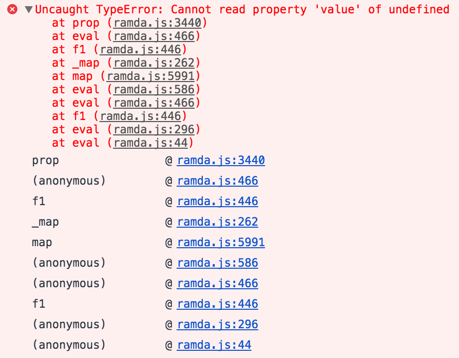

# babel-plugin-transform-function-composition-name

A [Babel](https://github.com/babel/babel/) transform plugin to name composition of functions.

[](https://travis-ci.org/Intai/babel-plugin-transform-function-composition-name)
[](https://coveralls.io/github/Intai/babel-plugin-transform-function-composition-name?branch=master)
[](https://www.codacy.com/app/intai-hg/babel-plugin-transform-function-composition-name?utm_source=github.com&amp;utm_medium=referral&amp;utm_content=Intai/babel-plugin-transform-function-composition-name&amp;utm_campaign=Badge_Grade)

## Want to achieve
For example when debugging the following code:
```javascript
const getValue = R.prop(
  'value'
);

const getValues = R.map(
  getValue
);

const calc = R.pipe(
  R.unapply(R.identity),
  getValues,
  R.sum
);

calc(
  { value: 1 },
  { value: 2 },
  undefined
);
```

The call stack from browser is not very useful:



It would be easier to debug with variable names:


## Installation
```sh
$ npm install babel-plugin-transform-function-composition-name
```

## Usage
### Via `.babelrc` (Recommended)
**.babelrc**
```json
{
  "plugins": [
    ["transform-function-composition-name", {
      "callee": "^R$",
      "variable": "^(?!(construct))"
    }]
  ]
}
```

### Via Node API
```javascript
require("babel-core").transform("code", {
  plugins: [
    ["transform-function-composition-name", {
      // configure function composition to be transformed.
      "callee": /^R$/, // optional function callee
      "variable": /^(?!(construct))/ // optional variable name
    }]
  ]
});
```
